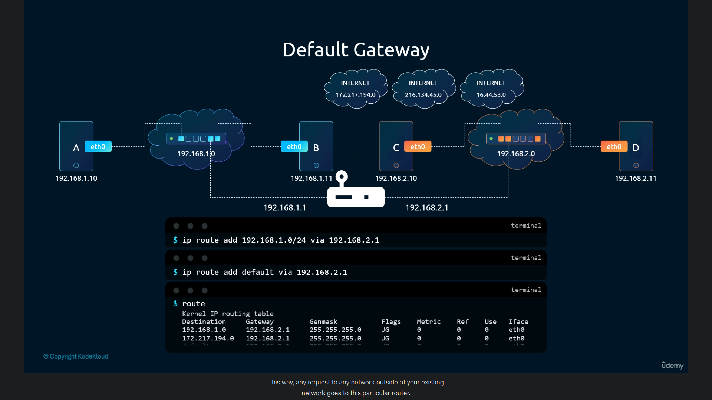

# Linux networking basics

- Switching
  - Its a rundimentary linux networking concept that links two systems over a network to share packets or information.
  - Switch is a devide that connects to systems on eth0, eth is ethernet(internet made available) on network interface. 
    Eth0 is a network interface that connects on the devide, if multiple interface for inetwork are implimented then numbers are increased in order to trak interface connected on a system.
  - System A with IP(192.168.1.5)- wants to talk with a System B with IP(192.168.1.6) then they both use an Network interface to connect to one another with a device called switch.
    switch connects to both system on eth0 respectively. then if system A wants to send message to system B then switch directs those packets based on IP and MAC to which machine/ system they should go to as destination.
  - System A (192.168.1.6) eth0------switch (192.168.1.0)-------eth0 system B(192.168.1.5)
  - packets directly transfer as both systems are on same network connected physically through a switch.
  - the swith trafsers the packets from eth0 to eth0 with ip and MAC as reference.

- Routing
  - When systems from different networks wants to engage in transactional connection, a medium to route packets from opne network to another is needed.
  - Router connects to both network, and ip routing is enabled with router as gateway.
  - the sender uses router as gateway to send packets to differnt network ip-cidr
    - ip addr add 192.168.2.0/24(dest-network cidr) via 192.168.3.0(router ip) on sender terminal.
  - if both network have housed switches then router sends traffic to switches then switch sorts packets by their destination ip and MAC.
  for this to have bidirectional, ip addr add <> via <> should be enabled on both sender and reciver systems to have ip forwarding.
  - to check ip forwarding enabled or not in your system
    - $ cat /proc/sys/net/ipv4/ip_forward
  - 
  - 